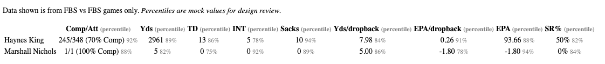

# Percentile Visuals on Team Page

Hi there, I wanted to propose a new feature for the team pages. Taking
inspiration from Cleaning The Glass I think showing percentiles on the
individual player stats would be helpful. This is a mockup image with
some fake data:

I am a Data Scientist by trade so I don't know exactly how best to implement
this feature. I am happy to help Codex drive and implement this service but I
wanted to get your approval before moving forward since this is your project.
I have reached out on twitter to get an API token but never got a response. I'm
hoping that this PR can serve as a place for us to discuss the implementation
details and see if y'all are comfortable with me moving forward.

This is a proposal outline generated from Codex on what changes are needed,
I hope its helpful:

### Percentile Stats Plan

This is a modest frontend/data-pipeline change: no new service, database, or
public API.

- Add a scheduled GitHub Action, runnable manually and daily during the season,
  that:
  - fetches full-season passing, rushing, and receiving summaries from
    SportsDataverse;
  - applies the existing leaderboard qualification thresholds;
  - calculates percentiles for every displayed stat, using completion percentage
    for the passing Comp/Att column;
  - writes compact `player ID → stat → percentile` JSON snapshots to the
    existing `SDV_API_CACHE` Cloudflare KV namespace, keyed by season and
    category; and
  - preserves the previous snapshot when an upstream request is incomplete or
    invalid.
- Add a one-time, manually run backfill for historical seasons; afterward, only
  refresh the active season.
- Update the team-page data helper to read the precomputed KV snapshot and pass
  the appropriate percentile map into the passing, rushing, and receiving
  tables.
- Update those three table components to show the current raw value followed by
  a muted percentage, with `(percentile)` in each stat header. Keep current
  formatting, ordering, and responsive horizontal scrolling unchanged.
- Add a small typed percentile interface and pure calculation helper; verify
  tied values, missing values, qualification boundaries, and the rendered
  Georgia Tech page. Run the existing Astro build in CI.

The existing deployment workflow already has `SDV_AUTH_TOKEN`,
`CLOUDFLARE_API_TOKEN`, and `CLOUDFLARE_ACCOUNT_ID`, and the Worker already
binds `SDV_API_CACHE`; the new workflow can reuse them. No new secrets or
Cloudflare resources should be required.
